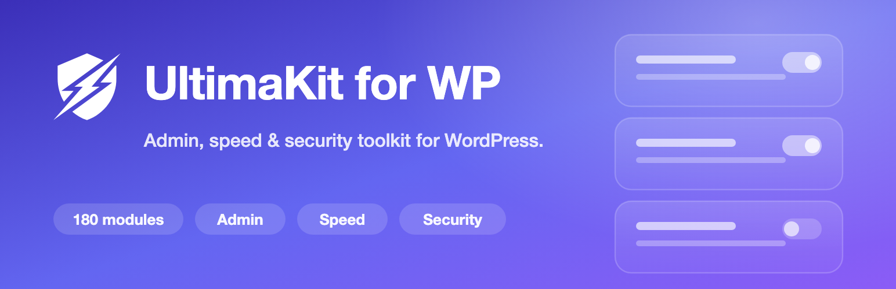

# UltimaKit for WP

180 admin, security and optimization tools in one WordPress plugin. Every tool is a module you switch on or off, and a module that is off loads nothing.

UltimaKit is free and GPL-licensed. Since version 3.0.0 there is no Pro version: the modules that used to be sold as UltimaKit Pro, including the WooCommerce and Gravity Forms modules, are part of the free plugin.

- **WordPress.org:** [wordpress.org/plugins/ultimakit-for-wp](https://wordpress.org/plugins/ultimakit-for-wp/)
- **Support forum:** [wordpress.org/support/plugin/ultimakit-for-wp](https://wordpress.org/support/plugin/ultimakit-for-wp/)
- **Made by:** [WPAnkit](https://wpankit.com/)

## What's inside

| Area | Examples |
| --- | --- |
| Admin | Hide admin notices, clean up the admin bar, ID and featured-image columns, quick admin search |
| Security | Change the login URL, limit login attempts, force strong passwords, disable XML-RPC, lock the site URL |
| Performance | Disable emojis, embeds and jQuery Migrate, remove the block library CSS, limit post revisions |
| Content | Duplicate posts and pages, drag-and-drop post order, media replacement, SVG upload |
| Power tools | Activity log, redirect manager, custom post types and taxonomies, maintenance mode, schema markup |
| WooCommerce (18) | Product timer, sale badge text, hide out-of-stock products, disable guest checkout |
| Gravity Forms (12) | Smart phone field, date-time field, email blacklist, pre-submission preview |

The full list is in [README.txt](README.txt).

## Requirements

- WordPress 5.6 or later
- PHP 7.4 or later

WooCommerce and Gravity Forms modules appear only when those plugins are active.

## Installing

Install UltimaKit from WordPress.org (**Plugins → Add New**, search for "UltimaKit"), then open **UltimaKit** in the admin menu and switch on the modules you want.

To run the code in this repository, clone it into `wp-content/plugins/ultimakit-for-wp` and activate it. The repository is the plugin, so there is no build step. Each push to `main` also produces an installable zip through the **Build plugin zip** workflow; `.distignore` lists what stays out of it.

## Moving from UltimaKit Pro

Install UltimaKit for WP from WordPress.org and activate it. That switches UltimaKit Pro off and keeps your settings; then delete Pro. A few Pro modules were retired rather than carried over. The FAQ in [README.txt](README.txt) lists them and explains what to check before you switch.

## Project status

UltimaKit is in maintenance mode: it gets security fixes and stays compatible with new WordPress versions. New modules are unlikely. Bug reports and pull requests are welcome.

## Contributing

- For bugs, open an issue with the steps to reproduce, your WordPress and PHP versions, and the module involved.
- Pull requests need to keep PHP 7.4 compatibility and follow the WordPress Coding Standards (`composer install`, then `composer lint`).
- Each module has its own folder under `modules/` (the former Pro modules are in `modules/pro-modules/`) with a `metadata.json` and a `class-wpultimakit-module-<name>.php`. A module that is switched off is never loaded.

## Reporting a security issue

Please don't open a public issue. Use **Report a vulnerability** on this repository's Security tab, so the report stays private until a fix is released.

## License

GPLv2 or later. See [LICENSE](LICENSE).
